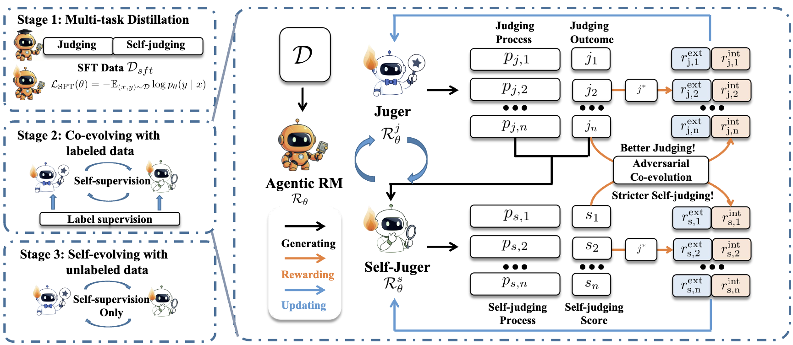

# SEAR: Self-Judging Agentic Reward Models


---

## Overview

Reward models play a central role in reinforcement learning and post-training of large language models (LLMs). Recent advances have extended reward models into **Agentic Reward Models**, enabling them to perform multi-step reasoning, tool use, and external verification before making judgments.

However, existing agentic reward models still suffer from two fundamental limitations:

1. **Coarse-grained supervision**: outcome-only labels provide little guidance for intermediate reasoning and tool-use behaviors.
2. **Expensive process supervision**: obtaining high-quality meta-judging annotations is costly and difficult to scale.

To address these challenges, we propose **SEAR (Self-Judging Agentic Reward Models)**, a self-evolving framework that enables reward models to explicitly evaluate and improve their own judging process.

SEAR introduces a dual-role training paradigm:

* **Judger**: evaluates candidate responses through reasoning and tool use.
* **Self-Judger**: critiques the judging trajectory and assigns self-judgment scores.

Through adversarial co-evolution, the judger learns to generate increasingly rigorous evaluation trajectories, while the self-judger becomes progressively more discriminative.

---

## Key Idea

Instead of relying on external meta-judges, SEAR internalizes the verification process.

Given a judging trajectory:

```text
Query + Candidate Responses
            ↓
        Judger
            ↓
 Judging Process + Decision
            ↓
      Self-Judger
            ↓
 Self-Judgment Score
```

The generated self-judgment score is then used as an additional supervision signal for reinforcement learning.

As training progresses:

* Better judging trajectories receive higher self-judgment scores.
* The self-judger continuously raises evaluation standards.
* Both roles improve together through adversarial co-evolution.


## Framework


SEAR consists of three stages:

1. Multi-task Distillation
2. Adversarial Co-Evolution
3. Self-Evolution on Unlabeled Data

The judger and self-judger are optimized jointly within a single rollout and a shared policy.

---

## Main Results


| Model                    | Average Score |
| ------------------------ | ------------- |
| Qwen3-8B (Outcome-only)  | 72.8          |
| Qwen3-8B (SEAR)          | 76.5          |
| Qwen3-14B (Outcome-only) | 75.4          |
| **Qwen3-14B (SEAR)**     | **78.8**      |

SEAR consistently improves reward modeling performance across all benchmarks and model scales.


---

## Why SEAR?

SEAR introduces a new perspective on reward modeling:

✅ Self-supervised process evaluation

✅ Internalized meta-verification

✅ Adversarial co-evolution between judging and self-judging

✅ Continual self-improvement on unlabeled data

✅ Inference-time self-refinement

Rather than treating reward modeling as a static preference prediction problem, SEAR transforms reward models into self-improving evaluators.

---


## Code and Models

Code, checkpoints, and training recipes will be released in the future.
